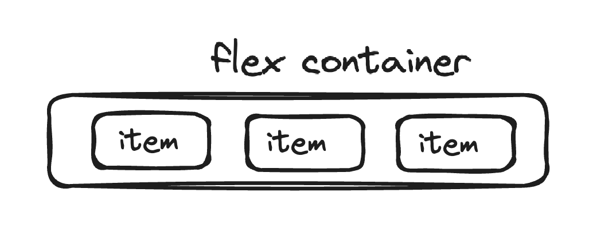
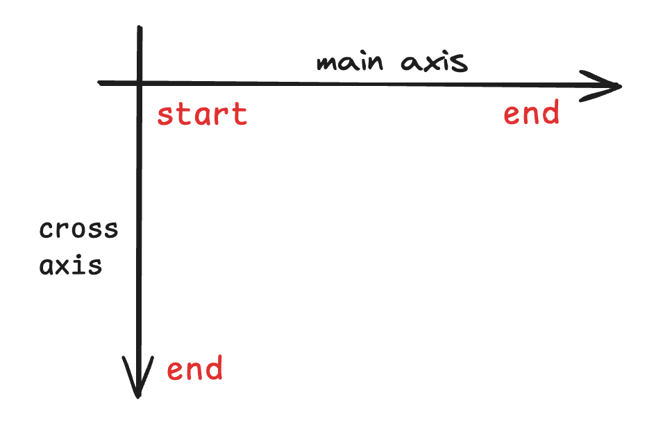

# Flex 弹性布局

## 前置知识

当使用了`display: flex`，该元素也称为 flex container，其大小默认包裹子元素的内容。子元素称为 flex item 不再严格区分行内/块元素，一般用于一维布局布局中。

## axis 轴

在介绍弹性布局之前，轴的概念至关重要，它决定了 flex-item 沿着什么样的方向进行布局。

1. 主轴 main axis
2. 交叉轴 cross axis

`flex-direction: row | row-reverse | column | column-reverse`  
通过该属性设置主轴的方向，默认为 row，案例如下所示

<Direction />

## container 属性

坐落于父元素的属性，用来控制子元素如何排布，我们来介绍几个常用的

### justifyContent

决定子元素在主轴方向，如何进行排布

<Justify />

### alignItems

决定子元素在交叉轴，如何进行排布, 其重要注意的是，alignItems：normal（默认值）。其表现形式和 stretch 类似，在没有高度的情况下，默认为拉伸直父元素高度

<Align />

### flexWrap

当 item 的大小，超过了 container 大小，如何进行排布

<Wrap />

## item 属性

### flex-grow （拉伸）

如果 container 有剩余宽度，设置该值 > 0 可以拉伸至 container 宽度。如果存在多个，根据设置的大小，进行等比分配。（剩下的长度 / grow 份额 \* grow 份额）

### flex-shrink （收缩）

如果超出了 container 的大小，设置该值 > 0 可以收缩至 container 宽度。存在多个，同 grow。

### flex-basis

基础宽度大小，多种大小的优先级：max-width > flex-basis > width

### order

设置的数值越小，位置越前面

### flex

是 grow shrink basis 的语法糖

- flex: 1
  - flex-grow: 1
  - flex-shrink: 1
  - flex-basis: 0%
- flex: auto
  - flex-grow: 1
  - flex-shrink: 1
  - flex-basis: auto
