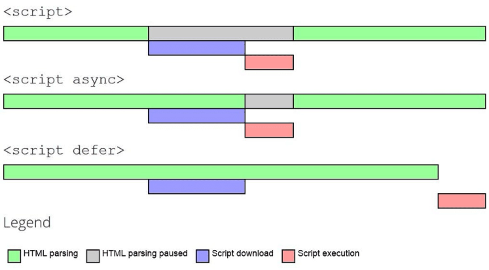
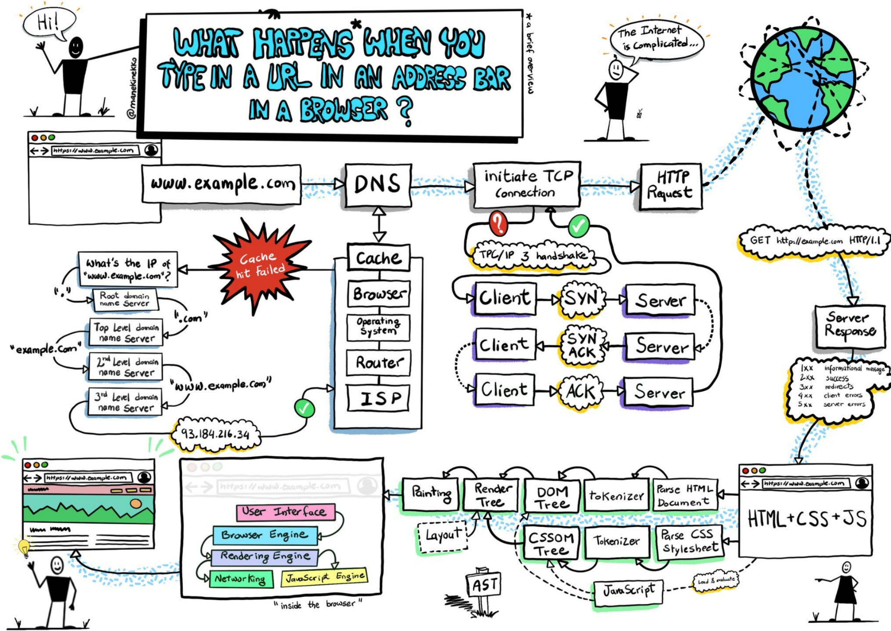

# HTML & CSSS

## 什么是 SEO？有哪些常见的 SEO 方法？

SEO 称之为搜索引擎优化，通过该手段可以有效的提高 google / bing 类似搜索权重
**常见的优化手段**

1. 从 SPA 转换为 SSR，利用服务端渲染，因为传统的 SPA 都是通过 js 动态加载 dom 的，而服务端渲染可以把 dom 直接传递给客户端，**从而提升首屏渲染速度，以及搜索引擎优化**
2. 合理设置 metadata title、keywords、description
3. 合理的使用语义化标签 比如：h1/h2 img alt 属性等
4. 设置 robots.txt 告诉网络爬虫哪些可以爬取，以及过滤一下不需要爬取的文件

## script 标签中 defer async 的区别

解析一个 html 文件的时候，浏览器是从上至下开始解析，如果遇到 script 文件，那么就会开始下载 script 并且执行 script 代码，当 script 在 head 中，那么就会阻塞 dom tree 的构建，从而浪费性能  
defer 和 async 出现就是为了解决这一问题

**共同点**

- defer async 都是异步下载的，不会阻塞 dom tree 的构建 （并行）

**不同点**

- defer 是在 domContentLoaded 之前执行的，而 async 是立即执行的
- defer 的执行是先后是有序的，而 async 是无序的



**最佳实践**

```html
<html>
  <head>
    <script defer src="./demo.js"></script>
  </head>
  <body>
    <div>ice</div>
  </body>
</html>
```

利用 defer 的属性，把 script 写在 head 中，尽可能的早点下载，不阻塞 dom tree 的构建，从而提升性能

## 物理像素 逻辑像素

**物理像素**  
它是真实存在的，比如每个手机的分辨率不同（硬件决定的），那么物理像素就不同。

**逻辑像素**  
它是虚拟的概念（抽象的），也称之为 css 像素。 比如我们日常开发 100px 的宽度，那么这个 100px 就是逻辑像素，即使是不同分辨率下，展示的大小是一致的。

**设备像素比**
它是物理像素和逻辑像素的比值，也就是 一个 css 像素等于多少个物理像素，如果比值越大，物理像素越多，那么显示的就更清晰更细腻。

```js
window.devicePixelRatio;
```

**移动端 2/3 倍图适配**

```css
.bg {
  background-image: url(./bg-1x.png);
}

@media screen and (min-resolution: 2dppx) {
  .bg {
    background-image: url(./bg-2x.png);
  }
}

@media screen and (min-resolution: 3dppx) {
  .bg {
    background-image: url(./bg-3x.png);
  }
}
```

背景图片可以利用媒体查询，可以适配不同的 DPR 比值

## 移动端 1px 问题

**为什么会出现 1px 问题？**

在实际开发中，一般 ui 给的设计图都是 750px 的，但是在实际开发中都是最小适配的 375px 的，在 750 中的 1px，其实在 375 中需要为 0.5px，但是很多浏览器 css 不支持 0.5px。

::: details 解决办法
<<< ./code/1px.html
:::

## 什么是 BFC？

BFC 称之为块级格式化上下文，它决定了块级元素的布局规则，块级元素垂直排列 从上至下，块级元素两者的间距由 margin 决定，如果在同一个 BFC 中，那么 margin 会进行重叠

**如何创建 BFC ？**

- 根元素
- float 不为 none
- position 为 absolute 或 fixed
- display 为 inline-block 或 table-cell 或 table-caption
- overflow 不为 visible

**解决 BFC Margin 重叠问题**

::: details 解决办法
<<< ./code/margin_collapse.html
:::

## 如何解决 css 兼容性问题

**使用 normalize.css**  
normalize.css 是一个用于解决 css 兼容性问题的库，它会对不同浏览器的默认样式进行修复，从而达到统一的效果

**现代工程的配置**

```js
{
  "browserslist": [
    "last 2 versions",
    "not ie <= 8"
  ]
}
```

利用 browserslist 通过 caniuse 查看浏览器支持的版本，从而达到适配的目的（加浏览器前缀）

## 当在浏览器中输入 url 后发生了什么？



1. 首先进行 DNS 解析，获取域名的 ip 地址

- 优先查找缓存，查找到从缓存中获取 （这样是更快的）
  - 浏览器缓存
  - 操作系统缓存
  - 路由器缓存
  - 网络运营商缓存 （ISP）
- 没有命中缓存，则进行 DNS 递归解析
  - 根域名服务器 （存取所以顶级域名服务器的 ip 地址）
  - 顶级域名服务器 （.com .org .cn）等
  - 权威域名服务器 （www.bing.com -> 返回对应的 ip 地址）

2. 获取到 ip 地址后，进行三次握手，建立连接

- 客户端发送 SYN 包到服务器
- 服务器返回 SYN-ACK 包给客户端
- 客户端返回 ACK 包给服务器

3. 建立连接后，浏览器发送 http 请求 （get 请求，通常是返回静态资源 html）

4. 客户端接受 html 文件后，开始解析该文件

- 解析 html 文件，构建 dom tree
  - 遇到 css 文件，下载 css 文件，并且解析
  - 遇到 script 标签，下载 js 文件，并且执行
- 解析 css 文件，构建 cssom tree
- 合并 dom tree 和 cssom tree，构建 render tree
- layout 阶段，计算每个元素的几何 （大小/位置）
- paint 阶段，绘制页面 （边框/颜色等）

## 回流重绘

**回流**  
回流是指当元素的尺寸、位置等属性发生变化时，浏览器需要重新计算元素的布局，从而导致页面重新渲染。

- 频繁操作 dom
- getComputedStyle

**重绘**  
重绘是指当元素的样式发生变化时，浏览器需要重新绘制元素，从而导致页面重新渲染。

**回流一定会导致重绘，重绘不一定会导致回流**

### 如何减少回流和重绘

**利用合成层 开启 GPU 加速**  
每个图层都是单独渲染的，不可滥用是牺牲内存为代价

- 脱标元素 -> position: fixed
- 利用 transform 的 translateZ(0) 开启 GPU 加速
- 利用 will-change 告诉浏览器该元素会发生变化，从而提前合成
