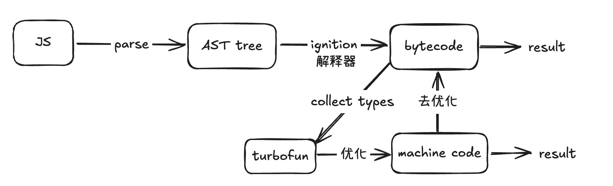
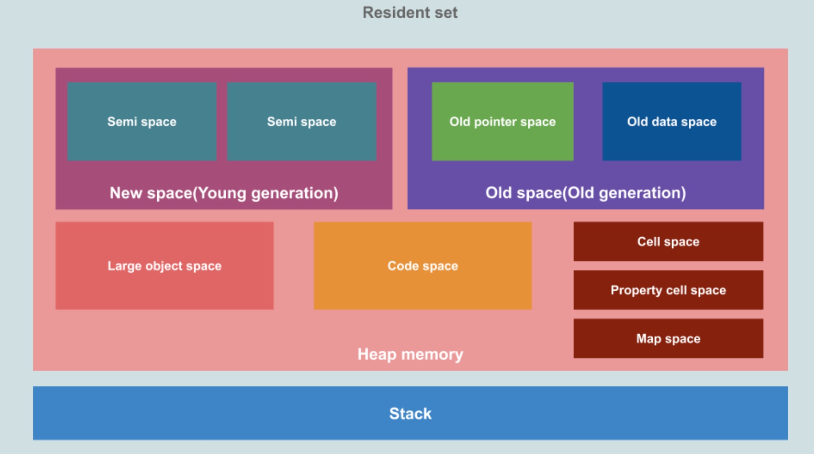

# JS

## Event Loop

### 浏览器

Event Loop 是 JavaScript 的执行机制，它是一个循环，不断地从任务队列中获取任务并执行。


JS 是**单线程**执行的，当遇到一些耗时操作，比如网络请求、定时器不会立即执行，而是放入到任务队列中，当主线程的代码执行完毕，在从任务队列中获取任务执行

1. 微任务队列
2. 宏任务队列

**宏任务**

- script
- 事件回调
- setTimeout
- setInterval
- requestAnimationFrame

**微任务**

- Promise.then
- MutationObserver
- queueMicrotask

**执行顺序**  
主线程 > 微任务 > 宏任务

**每次执行宏任务之前，需要确保微任务队列清空**

- 如果宏任务中加入了微任务，那么需要先执行微任务，再执行宏任务

### Node

Node 中的 Event Loop 是基于 libuv 实现的，简单来说相比浏览器而言，它会有 3 个 事件队列

- 2 个微任队列

1. nextTick
2. promise.then 或者其他微任务

- 1 个宏任务队列
  - 宏任务分为 6 个 阶段 （一次 tick）
    - timers
    - pending callbacks
    - idle, prepare
    - poll
    - check
    - close callbacks

**执行顺序**

主线程 > 微任务（nextTick > promise.then） > 宏任务

## 浏览器内核 （渲染引擎）

目前主流的浏览器内核有：

- Gecko 内核：Firefox
- Webkit 内核：Safari
- Blink 内核：Chrome

**Webkit 内核**

Webkit 内核分为两部分：

- WebCore：负责 HTML 的解析、布局、渲染等
- JavaScriptCore：负责 JavaScript 的解析、执行

**V8 引擎**

V8 引擎是 Google 开发的 JavaScript 引擎，它将 JavaScript 代码编译为机器码，并执行。

**V8 引擎的执行过程**

1. 解析 JavaScript 代码，生成抽象语法树（AST）

- parse 词法分析、语法分析 最后生成 AST

2. 将 AST 转换为字节码

- ignition(点火) 将 AST 转换为字节码

3. 执行字节码

- turboFan （收集类型信息） 将字节码转换为机器码，提高执行效率



## GC 内存

### 垃圾回收算法

**引用计数**

顾名思义，就是记录每个对象的引用次数，当引用次数为 0 时，就认为该对象是垃圾，可以被回收。

```js
const info = { name: "ice" };

const obj = {
  friend: info,
};
```

此时的 info 的引用次数就为 2，obj 的引用次数为 1

该算法不能解决循环引用问题

```js
const a = {
  f: b,
};
const b = {
  f: a,
};
```

此时 a 和 b 的引用次数都为 1，无法被回收

**标记清除**

其核心思想是可达性，从根节点出发如果不能访问到该对象，就认为是垃圾

算法优化

1. 标记整理，搬运到连续的内存中，避免内存碎片化，从而减少内存的浪费
2. 分代收集

- 新生代
  - 分为两个工作区，经过两轮标记后，存活的对象会被移动到老生代，diff 就被复制到另外一个工作区 （减少内存碎片）
- 老生代
  - 长期存活的对象，减少检查次数

3. 增量收集

- 将垃圾回收拆分为多个小任务，穿插在 JS 执行中执行，避免出现卡顿

4. 闲时收集

- 在浏览器空闲时执行垃圾回收，避免影响用户体验

### V8 内存图


