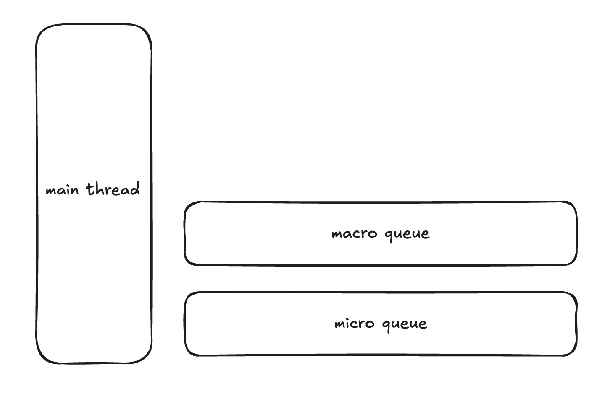

# JS

## Event Loop

Event Loop 是 JavaScript 的执行机制，它是一个循环，不断地从任务队列中获取任务并执行。

JS 是**单线程**执行的，当遇到一些耗时操作，比如网络请求、定时器不会立即执行，而是放入到任务队列中，当主线程的代码执行完毕，在从任务队列中获取任务执行

1. 微任务队列
2. 宏任务队列

**宏任务**

- script
- 事件回调
- setTimeout
- setInterval
- requestAnimationFrame

**微任务**

- Promise.then
- MutationObserver
- queueMicrotask

**执行顺序**  
主线程 > 微任务 > 宏任务

**每次执行宏任务之前，需要确保微任务队列清空**

- 如果宏任务中加入了微任务，那么需要先执行微任务，再执行宏任务
