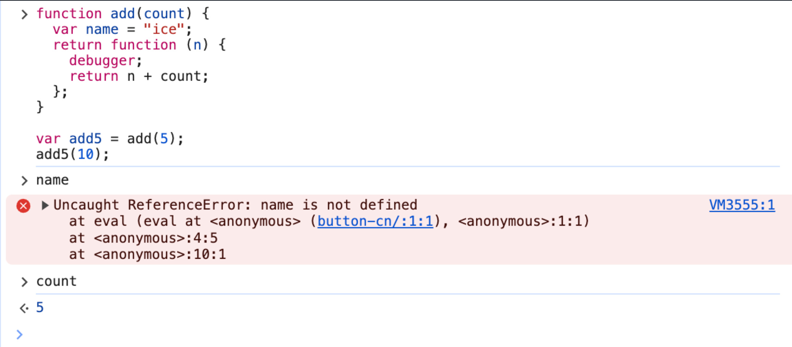

# 内存 & 闭包

## 内存管理

前面我们在数据结构中有说到，原始数据类型 / 引用数据类型，分别存放在内存的栈/堆结构中。
在不同的编程语言中，收集方式不同，有的时候自动管理 （JS） ，而有的需要手动管理 （C）
但是过程都为三步骤

1. 申请内存空间
2. 应用内存 （存放数据）
3. 不需要时，释放内存

## 垃圾回收 （GC）

因为内存的大小是有限的，当对象数据不在需要的时候需要对它进行回收 （GC），以释放出更多的内存空间。那么 GC 怎么知道哪些数据是不在使用的呢？常见的 GC 算法如下

### 引用计数

如果存在一个引用那么数字就进行递增，当一个对象的引用为 0 的时候就销毁  
**弊端：循环引用 导致内存不会被销毁**

<!--  -->


### 标记清除

其本质：**可达性**  
从根节点出发如果不存在该节点的引用，就应该被销毁，JS 引擎采用的就是该算法


**更多性能优化**

- 标记整理
  - 与标记清除类似，回收期间保留存储对象搬运汇集到连续的内存中，从而整合空闲空间，避免内存的碎片化
- 分代收集
  - “新 旧”，长期存活的对象变得“老旧”，从而减少检查的频率;
- 闲时收集
  - 只在 CPU 空闲时常试运行

### 如何排查内存泄漏

::: details
<<< ./demo/GC.html
:::

1. 页面打开点击 memory 进行第一次快照
2. 点击创建按钮，进行第二次快照 （发现内存爆增）
3. 点击回收按钮，进行第三次快照，发现内存被回收

## 闭包 (Closure)

Closure 最早是出现在 Scheme 当中，而 JS 中许多灵感都来自于此。
什么是闭包：简而言之，就是函数引用了上层作用域的自由变量，原本应该销毁的作用域因其而（闭包）保留，不会被销毁

- 作用域 = AO 对象 + parent scopes

### 示例

**思考以下代码**

```js
function add(count) {
  return function (n) {
    return n + count;
  };
}

var add5 = add(5); // step 1
add5(10); // step 2 => 15
```

1. 执行函数 `add` 后，返回了一个新的函数，该函数引用了上层作用域的 count ->（5）
2. 执行返回的函数得到 15，注意：执行到这里本该释放的作用域没有被释放，也就是 `add5` 对其有引用
3. 如果后续不需要执行的话，就应该释放其引用，否则会产生内存泄漏

- ```
  add5 = null // [!code ++]
  ```

**如果引用了上层作用域变量，只有该变量会被保留，还是整条作用域被保留？**  
尝试 debug 该代码

```js
function add(count) {
  var name = "ice";
  return function (n) {
    debugger;
    return n + count;
  };
}

var add5 = add(5);
add5(10);
```

  
所以只有该引用的变量会保留
