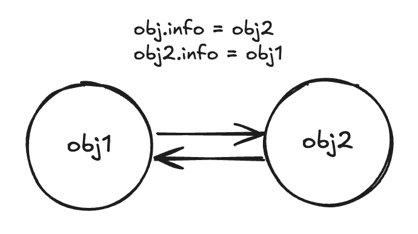
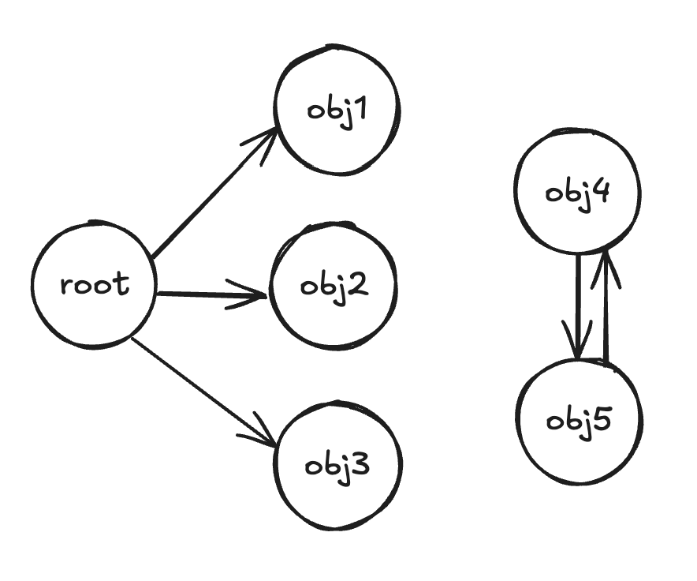

# 内存 & 闭包

## 内存管理

前面我们在数据结构中有说到，原始数据类型 / 引用数据类型，分别存放在内存的栈/堆结构中。
在不同的编程语言中，收集方式不同，有的时候自动管理 （JS） ，而有的需要手动管理 （C）
但是过程都为三步骤

1. 申请内存空间
2. 应用内存 （存放数据）
3. 不需要时，释放内存

## 垃圾回收 （GC）

因为内存的大小是有限的，当数据不在需要的时候需要对它进行回收 （GC），以释放出更多的内存空间。那么 GC 怎么知道哪些数据是不在使用的呢？常见的 GC 算法如下

### 引用计数

如果存在一个引用那么数字就进行递增，当一个对象的引用为 0 的时候就销毁  
**弊端：循环引用 导致内存不会被销毁**

<!--  -->

### 标记清除

其本质：**可达性**  
从根节点出发如果不存在该节点的引用，就应该被销毁，JS 引擎采用的就是该算法

**更多性能优化**

- 标记整理
  与标记清除类似，回收期间保留存储对象搬运汇集到连续的内存中，从而整合空闲空间，避免内存的碎片化
- 分代收集
  “新 旧”，长期存活的对象变得“老旧”，从而减少检查的频率
- 闲时收集
  只在 CPU 空闲时常试运行
