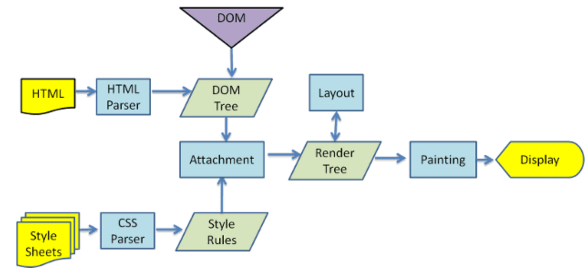

# 浏览器渲染原理

## 从浏览器中访问 https://fe-system.vercel.app/ 经历了什么？

1. DNS 解析 域名 -> ip （会被缓存，解析一次）
2. TCP 三次握手 + HTTPS TLS 一次握手 (选择哪种密码进行加密)
3. 建立连接以后，浏览器向服务器发送初始化的 GET 请求，返回服务器的 HTML 文件
4. 浏览器解析 HTML 文件，构建出 DOM Tree + CSSOM Tree

- dom 树的构建的时候，遇见一个 css 文件，DOM 可以继续进行解析，若遇到 `script` 标签（没有 `async / defer`）属性，会阻塞渲染并停止 HTML 的解析
- css 会阻塞 js，因为 js 用于查询元素的 css

5. renderTree = DOMTree + CSSOMTree

6. layout / paint

- layout 布局阶段：
  - 第一次确定（尺寸位置 + 大小位置）
  - 之后对整个页面/部分，重新计算大小/位置 （reflow 回流 / 重排）
    - DOM 结构发生了变化 （新增/移除节点）
    - 改变了布局，width、height、padding ...
    - 调用 getComputedStyle 方法获取尺寸、位置信息
- paint 绘制阶段：
  - 第一次绘制到屏幕上 text、color、border ...
  - 之后进行绘制 （repaint 重绘）
    - 修改背景色、文字颜色、边框 ...
  - 合成层： 开启 GPU 加速， opacity、transform、will-change （以牺牲内存为代价，不可过度使用）

渲染图如下所示：  

## async / defer

在 script 标签中，async 和 defer 属性都不会阻塞 DOM 树的构建，但是它们**只对外部文件有效**

### 两者的区别

- 执行顺序
  - defer 可以保证正确的执行顺序 通常放到 head 中，可以提高性能
  - async 属性执行顺序不能保证，它是独立下载、独立运行、不会等待其他脚本的
- DOMContentLoaded
  - defer 执行完成后，DOMContentLoaded 事件触发
  - async 则不能保证在 DOMContentLoaded 之前或者之后处罚
