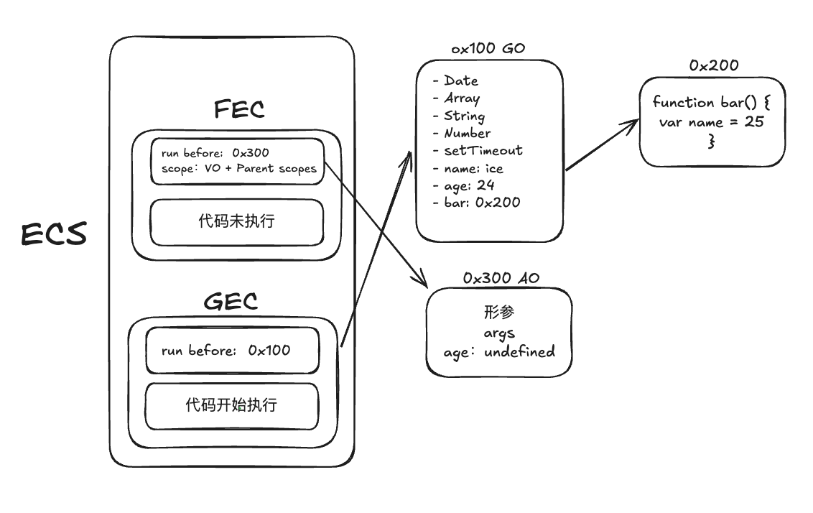
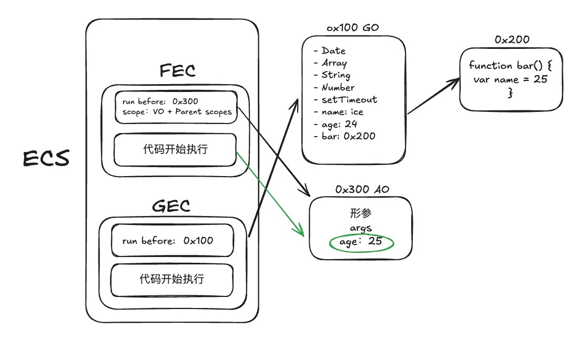

# 运行原理 & 作用域

## 浏览器内核

1. Webkit

- WebCore 负责 HTML 解析、布局、渲染相关工作
- JSCore 解析、执行 JS 代码

2. Blink 前者的一个分支

...

## V8 引擎

JSCore 是由苹果公司开发的，同时也是 WebKit 渲染引擎的一部分，负责处理 JavaScript 代码的解释和执行。  
V8 是由 Google 开发的高性能 JavaScript 引擎，用于执行 JavaScript 代码。

## JS 代码执行原理

思考以下代码，它在 JS 中时如何被执行的

```js
var name = "ice";

function bar() {
  var age = 25;
}

var age = 24;

bar();
```

### 名词概念

- 全局对象 （Global Object）GO
- 执行上下文栈 （Execution Context Stack）（ESC）
- 全局执行上下文 （Global Execution Context）（GEC）
- 函数执行上下文 （Function Execution Context）（FEC）
- 变量对象 （Variable Object）VO
- 激活对象 （Activation Object）AO
- 每一个执行上下文，都会关联一个 VO 对象，变量/函数声明都会添加到这个 VO 对象中

### Init Global Object

JS 引擎会初始化全局对象，在执行代码之前，会在堆 (heap) 内存中，创建一个全局对象（Global Object）

- Date
- Array
- String
- Number
- setTimeout
  ...


### ECS

js 引擎内部有一个**执行上下文栈**，是代码的调用栈  
那么现在开始，执行谁的代码呢？ => **全局代码**

- 执行全局代码，会构建出一个全局执行上下文栈（GEC）
  1. parser -> AST 树过程中，将全局定义的变量、函数加入到 Global Object 中，但是不会赋值，也称 hoisting （作用域提升）
  2. 执行代码，对变量赋值或者执行其他的函数
  3. 此时的 VO == GO

解析图：

**解析阶段**


**代码开始执行**


### FEC

前面分析到了 ESC，当执行到函数的时候会创建一个函数执行上下文 （FEC），并且压入到 stack 中

1. 当进入到函数执行上下文，会创建一个 AO 对象
2. 使用 arguments 作为初始化，初始值是传入的参数
3. 此时的 scope 已经产生，作用域跟哪里定义的有关，跟哪里执行无关
4. 此时的 VO == AO

解析图：

**解析阶段**


**代码开始执行**


## 作用域

### 全局作用域

```js
var name = "ice";

console.log(name); // ice
```

通过 var 定义的变量，会赋值在 window 上

### 函数作用域

```js
var name = "ice";

function bar() {
  var name = "panpan";
  console.log(name); // panpan
}
```

函数拥有自己的作用域，即 name = 'panpan'

### 块级作用域

早期 var 是没有没有独立的作用域的，从而导致不可预料之外的结果

```js
for (var i = 0; i < 5; i++) {
  setTimeout(() => console.log(i), i * 1000); // 5次 5
}

// 利用函数作用域 + 闭包 变相解决
for (var i = 0; i < 5; i++) {
  (function (i) {
    setTimeout(() => console.log(i), i * 1000); // 0 1 2 3 4
  })(i);
}
```

let/const 有块级作用域，代码会变得简洁明了

```js
for (let i = 0; i < 5; i++) {
  setTimeout(() => console.log(i), i * 1000); // 0 1 2 3 4
}
```

### 作用域链

```js
const name = "panpan";
function bar() {
  const name = "ice";

  function foo() {
    const name = "iceweb";
    console.log(name); // iceweb
  }

  foo();
}

bar();
```

作用域链（Scope Chain）则是 JavaScript 中用于确定变量访问顺序的机制。作用域链是由函数创建时的词法环境（Lexical Environment）决定的，它决定了变量的查找顺序，当在当前作用域找不到变量时，会沿着作用域链向上查找直到全局作用域。
