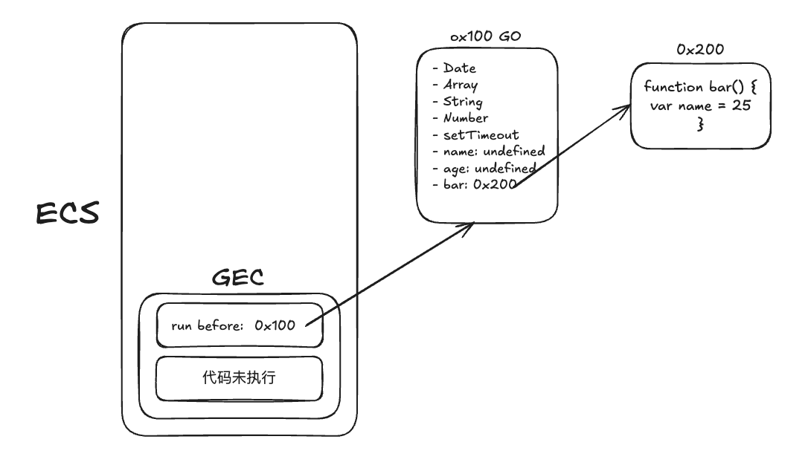

# 运行原理 & 作用域链

## 浏览器内核

1. Webkit

- WebCore 负责 HTML 解析、布局、渲染相关工作
- JSCore 解析、执行 JS 代码

2. Blink 前者的一个分支

...

## V8 引擎

JSCore 是由苹果公司开发的，同时也是 WebKit 渲染引擎的一部分，负责处理 JavaScript 代码的解释和执行。  
V8 是由 Google 开发的高性能 JavaScript 引擎，用于执行 JavaScript 代码。

## JS 代码执行原理

思考以下代码，它在 JS 中时如何被执行的

```js
var name = "ice";

function bar() {
  var age = 25;
}

var age = 24;

bar();
```

### 名词概念

- 全局对象 （Global Object）GO
- 执行上下文栈 （Execution Context Stack）（ESC）
- 全局执行上下文 （Global Execution Context）（GEC）
- 函数执行上下文 （Function Execution Context）（FEC）
- 变量对象 （Variable Object）VO
- 激活对象 （Activation Object）AO
- 每一个执行上下文，都会关联一个 VO 对象，变量/函数声明都会添加到这个 VO 对象中

### Init Global Object

JS 引擎会初始化全局对象，在执行代码之前，会在堆 (heap) 内存中，创建一个全局对象（Global Object）

- Date
- Array
- String
- Number
- setTimeout
  ...


### ECS

js 引擎内部有一个**执行上下文栈**，是代码的调用栈  
那么现在开始，执行谁的代码呢？ => **全局代码**

- 执行全局代码，会构建出一个全局执行上下文栈（GEC）
  1. parser -> AST 树过程中，将全局定义的变量、函数加入到 Global Object 中，但是不会赋值，也称 hoisting （作用域提升）
  2. 执行代码，对变量赋值或者执行其他的函数
  3. 此时的 VO === GO

解析图：

**解析阶段**


**代码开始执行**

