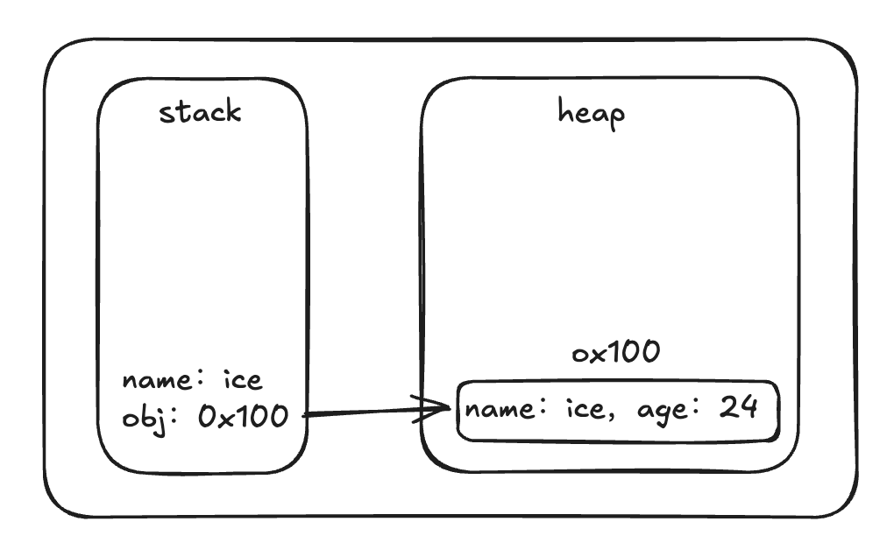

# data-types

## 类别

截止目前为止（2024），分为**两大类**（简单/复杂），**八种数据类型**

1. 简单数据类型（原始）
   - 简单数据类型占用内存小，存储在栈空间，栈空间存储值
   - 分别为
     1. String
     2. Number
     3. Boolean
     4. Undefined
     5. Null
     6. Symbol
     7. BigInt
2. 复杂数据类型
   - 复杂数据类型占用内存大，存储在堆空间，栈空间存储其引用（指针）指向堆空间
     1. Object

**查看以下代码内存图**

```js
const obj = { name: "ice", age: 24 };
const name = "ice";
```



## 区分数据类型

1. typeof
2. instanceof
3. Object.prototype.toString.call(this)

### typeof

它可以用来区分出简单数据类型或函数

```js
typeof "ice"; // 'string'
typeof 25; // 'number'
typeof 25n; // 'bigint'
typeof true; // 'boolean'
typeof undefined; // 'undefined'
typeof (() => {}); // 'function'

typeof {}; // 'object'
typeof []; // 'object'
typeof null; // 'object'
```

它不能用来区分对象类型，因为都会是 `object` （除了 func），另外 `typeof null === 'object'`，[即诞生以来即使如此](https://developer.mozilla.org/zh-CN/docs/Web/JavaScript/Reference/Operators/typeof#typeof_null)。因为在 js 中 存储值，分为两种

1. 类型标签
2. 存储值

object 的类型标签是 0 ，null 在大多数语言中代表空指针 （0x00），所以它 `typeof null  === 'object'`

### instanceof

用来区分复杂数据类型，后续在原型链一文会详细介绍

```js
/**
 * 1. A instanceof B
 *  A 的原型链中是否出现过 B 的原型对象
 */

({}) instanceof Object; // true

// 等同于

// ({}).__proto__ === Object.prototype

[] instanceof Array; // true
```

### toString

`Object.prototype.toString` 方法，可以判断复杂/简单数据类型，大部分包装类都会实现自己的 `toString` 方法（重写），利用它以及 `call` 改变其 this 指向，可以拿到精确的类型

```js
Object.prototype.toString.call(0); // '[object Number]'
Object.prototype.toString.call(""); // '[object String]'
Object.prototype.toString.call(null); // '[object Null]'
Object.prototype.toString.call(null); // '[object Null]'
Object.prototype.toString.call(() => {}); // [object Function]
Object.prototype.toString.call([]); // '[object Array]'
Object.prototype.toString.call({}); // '[object Object]'
```

### getDataType

我们知道，可以通过 toString 拿到更精确的数据类型，那么我们来实现一个 getDataType 工具函数

<<< ./utils/getDataType.js

## 包装类

```js
// 1. 包装类
const name2 = new String("ice");
// 2. 字面量
const name1 = "ice";
```

从上面的代码，我们可以得知 name1 只是一个单纯的字符串，而 name2 是一个对象。

```js
const name1 = new String("ice");
name1.toUpperCase(); // ICE

const name2 = "ice";
name2.toUpperCase(); // ICE
```

- name1 它的“隐式原型”是 `String.prototype`，因为它是 String 的实例对象，所以它继承了父类原型上的方法，因此可以调用 toUpperCase 方法
- name2（原始值） 它也可以调用 toUpperCase，这是为什么呢？ 它不就是一个简单的字符串吗？
  - 每当用到某个原始值的方法，后台都会创建对应的包装类型对象，从而暴露出操作原始值的各种方法
    1. 创建 String 类型的实例
    2. 调用实例上的特定方法
    3. 销毁实例

也就是说

```js
const name2 = "ice";
const uName2 = name2.toUpperCase(); // ICE

// 相当于

let name3 = new String("ice");
const uName3 = name3.toUpperCase(); // ICE
name3 = null;
```

前面我们有说道原始类型/复杂数据的区别，这也是这样设计的原因

## 隐式类型转换
