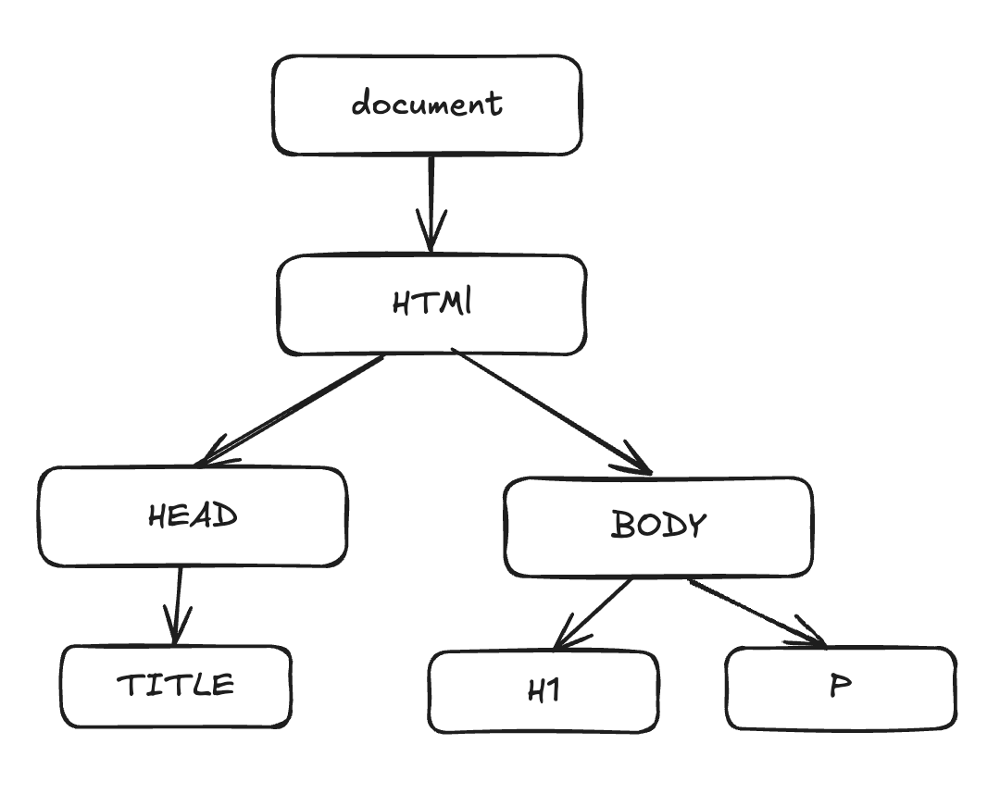

# Dom & Event

dom 的全称是 document object model （文档对象模型）

## Dom 树

顾名思义，它是一个树结构，如下图所示


## data-\*

在 HTML5 中，我妈可以通过 data-\* 自定义属性，它可以从 dataset 属性中获取

```html
<div class="info" data-name="ice" data-age="24"></div>

<script>
const info = document.querySelector(".info")
console.log(info.dataset) // { name: 'ice', age: 24 }
<script/>
```
