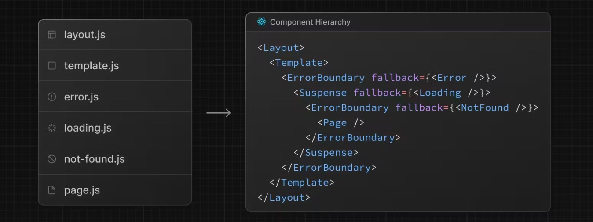

# App Router 的目录结构

```
└── app
    ├── page.js
    ├── layout.js
    ├── template.js
    ├── loading.js
    ├── error.js
    └── not-found.js
    ├── about
    │   └── page.js
    └── more
        └── page.js
```



## layout / 与 template 的区别

template 不会进行状态的保留，layout 会进行状态的保留

## loading

本质上

```tsx
<Suspense fallback={<div>Loading...</div>}>
  <Page />
</Suspense>
```

page throw 一个 promise，当组件加载完成，promise 会 resolve，替换掉 fallback 的组件

## error & global error

error 组件只能捕获页面级别的错误，而 global error 可以捕获顶层的错误（layout、template）

**最佳实践**

- 使用 global error 捕获顶层的错误
- 使用 error 组件捕获页面级别的错误

## not-found

1. 如果页面不存在，则显示 not-found 组件
2. 显示的返回 not-found 组件，寻找最近的 not-found 组件
