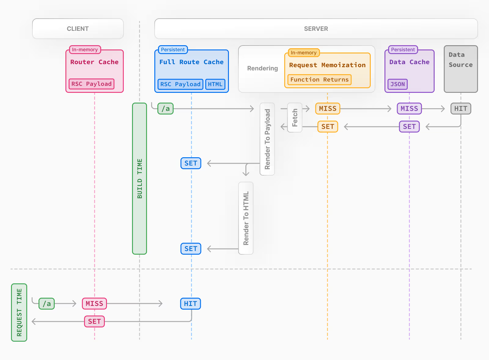

# 缓存策略



## 请求记忆 Request Memoization

这是 react 的缓存策略，在 nextjs 中 (服务端组件)，无论是在 layout / page / 组件中，fetch 相同的请求 & 参数，返回值会被缓存，不会多次发送请求

### 示例

```tsx
import { useEffect, useState } from "react";

async function getData() {
  const result = await fetch("https://api.thecatapi.com/v1/images/search");
  return await result.json();
}

const HomePage = async () => {
  const [data] = await getData();

  return (
    <div>
      <h3>{data.id}</h3>
      
      <hr />
      <ImgCache />
    </div>
  );
};

const ImgCache = async () => {
  const [data] = await getData();

  return (
    <>
      <h3>{data.id}</h3>
      
    </>
  );
};

export default HomePage;
```

### 退出缓存

这是 react 的缓存 `cache` 策略，不推荐退出

```tsx
async function getData() {
  const { signal } = new AbortController(); // [!code ++]
  const result = await fetch("https://api.thecatapi.com/v1/images/search", {
    signal, // [!code ++]
  });
  return await result.json();
}
```

## 数据缓存

数据缓存是指：如果是静态渲染，构建的时候会进行预渲染，生成数据缓存和完整路由缓存，下次访问的时候不会重新在服务端请求数据，而是直接返回缓存的数据 (缓存：JSON)  
退出数据缓存，同时会变为动态渲染 （退出完整路由缓存）

### 退出缓存

```tsx
async function getData() {
  const result = await fetch("https://api.thecatapi.com/v1/images/search", {
    // 退出数据缓存
    cache: 'no-store' // [!code ++]
  });
  return await result.json();
```

## 完整路由缓存

完整路由缓存的产物是：HTML 和 RSC payload，指的是动态渲染，动态渲染和数据缓存是不同的东西，数据缓存只是数据，不会缓存 HTML 和 RSC payload

### 退出缓存

```tsx
async function getData() {
  const result = await fetch("https://api.thecatapi.com/v1/images/search", {
    // 强制缓存
    cache: "force-cache",
  });
  return await result.json();
}

// 采用动态渲染 -> 缓存：HTML / RSC payload
export const dynamic = "force-dynamic";

async function Page() {
  const [data] = await getData();

  return (
    <div>
      <h2>{new Date().toLocaleTimeString()}</h2>
      <h4>{data.id}</h4>
      
    </div>
  );
}

export default Page;
```

## 路由缓存

路由缓存是存储在客户端的，存储 RSC payload，在导航前进/退后的时候，不会重新获取 RSC Payload(默认行为)， 当发生硬导航则会  
**通过软导航也不会退出路由缓存**

### 示例

```tsx
// layout.tsx
import Link from "next/link";

const RootLayout = ({ children }: { children: React.ReactNode }) => {
  return (
    <html>
      <body>
        {children}
        <div style={{ display: "flex", gap: 20 }}>
          {/* link 标签会提前获取 RSC payload */}
          <Link href="/route_cache">Route Cache</Link>
          <Link href="/product">Product</Link>
        </div>
      </body>
    </html>
  );
};

export default RootLayout;
```

```tsx
// product.tsx
export const dynamic = "force-dynamic";

const ProductPage = () => {
  return <div>ProductPage {new Date().toLocaleTimeString()}</div>;
};

export default ProductPage;
```

```tsx
// route_cache.tsx
export const dynamic = "force-dynamic";

const RouteCachePage = () => {
  return <div>RouteCachePage: {new Date().toLocaleTimeString()}</div>;
};

export default RouteCachePage;
```

### 退出缓存

```tsx
// next.config.js

/** @type (import('next').NextConfig) */
module.exports = {
  experimental: {
    staleTimes: {
      dynamic: 30,
      static: 180,
    },
  },
};
```
