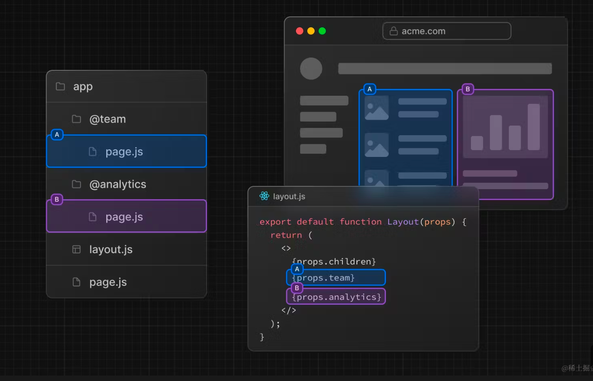
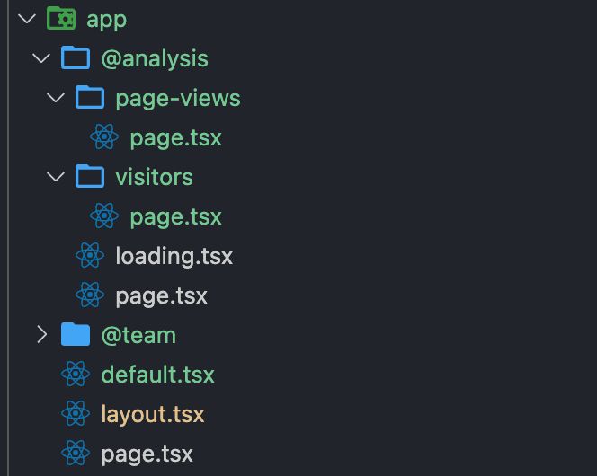

# 路由

## 动态路由

```
1. [folderName]

/blog/[id]/page.tsx -> path: /blog/:id

2. [...folderName]

匹配后面所有的路径
/blog/[...slug]/page.tsx
/blog -> 不匹配
/blog/product/123/page.tsx -> params: {slug: ['product', '123']}

3. [[...folderName]] 代表可选的

/blog/[[...slug]]/page.tsx
/blog -> 匹配
/blog/product/123/page.tsx -> params: {slug: ['product', '123']}

```

## 路由组

可以用来创建多个布局, 比如 B (端)，和 C (端)，放在同一个目录下（常用），然后通过路由组来区分


## 平行路由

类似于 slot 功能，children 是一个隐式 slot（@children）



### default.js 默认路由

当平行路由中存在子路由



当通过 Link 组件访问 `/page-views`（软导航），会匹配到子路由，其他的会保留上一次的路由状态  
当刷新页面（硬导航），匹配子路由 -> default.js -> 404

- 为什么没匹配到？ 因为访问 `/page-views` 不仅仅是 `@analysis`,还有 `@team` `children`(他们是没有`page-views`页面的)

### 应用场景

- 独立路由处理
  - loading 实现，分包的效果
  - 可以单独处理 error 状态等
- 子路由的使用

## 拦截路由
