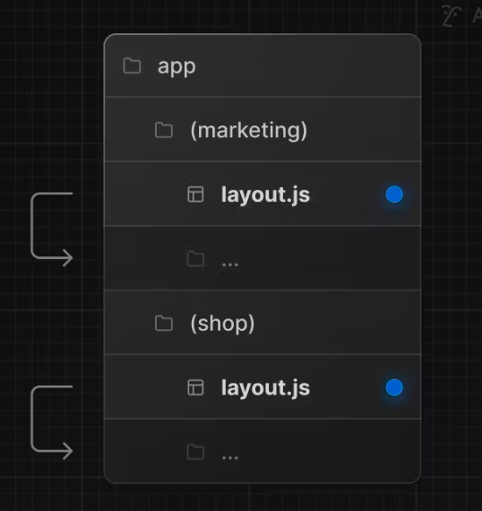

## 动态路由

```
1. [folderName]

/blog/[id]/page.tsx -> path: /blog/:id

2. [...folderName]

匹配后面所有的路径
/blog/[...slug]/page.tsx
/blog -> 不匹配
/blog/product/123/page.tsx -> params: {slug: ['product', '123']}

3. [[...folderName]] 代表可选的

/blog/[[...slug]]/page.tsx
/blog -> 匹配
/blog/product/123/page.tsx -> params: {slug: ['product', '123']}

```

## 路由组

可以用来创建多个布局, 比如 B (端)，和 C (端)，放在同一个目录下（常用），然后通过路由组来区分



## 平行路由
