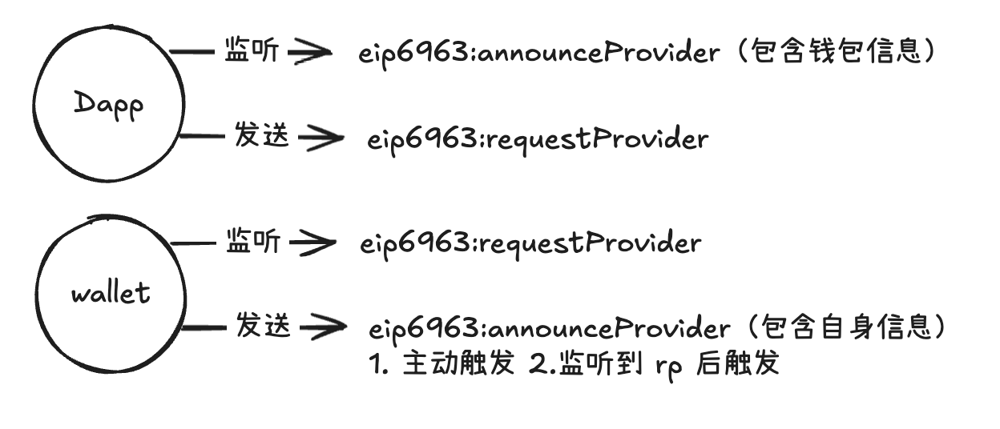

# EIP-6963 标准

EIP-6963 是对 EIP-1193 的改进，主要解决多钱包插件注入（冲突）的问题，传统 EIP1193 标准是通过 `window.ethereum` 对象实现 DApp 与钱包的通信，但当用户安装多个钱包插件时，最后加载的钱包会覆盖其他钱包，导致用户无法自主选择使用哪个钱包。EIP-6963 通过引入**事件机制** 和 **标准化接口**，实现了多钱包的自动发现和用户选择功能。

## JS 实现事件的通信

```js
window.addEventListener("ice_event", (event) => {
  console.log(event.detail);
});

window.dispatchEvent(
  new CustomEvent("ice_event", {
    detail: {
      name: "ice",
      age: 25,
    },
  })
);
```

## 核心概念

### 事件机制



**Dapp**

1. 先监听 `eip6963:announceProvider`, 获取钱包列表
2. 主动 dispatch `eip6963:requestProvider`

**Wallet**

1. 监听到 Dapp `eip6963:requestProvider`，同步返回 `eip6963:announceProvider` 的事件，包含钱包元信息
2. 钱包主动 dispatch `eip6963:announceProvider` 的事件，包含钱包完整信息

### 标准化接口

```ts
// 钱包元数据
interface EIP6963ProviderInfo {
  uuid: string;
  name: string;
  icon: string;
  rdns: string;
}

// 钱包完整信息
interface EIP6963ProviderDetail {
  info: EIP6963ProviderInfo;
  provider: EIP1193Provider; // 实现EIP-1193 的 provider 对象
}
```

### 实现代码

```tsx
"use client";

import { useEffect, useState } from "react";

const HomePage = () => {
  const [wallets, setWallets] = useState([]);
  const [address, setAddress] = useState("");

  useEffect(() => {
    const handleAnnounce = (event: CustomEvent<EIP6963ProviderDetail>) => {
      const { info, provider } = event.detail;
      setWallets((prev) => {
        if (prev.some((item) => item.info.uuid === info.uuid)) {
          return prev;
        }
        return [...prev, { info, provider }];
      });
    };

    /** 先监听，后发送*/

    // 1. 先监听 announceProvider 事件
    window.addEventListener("eip6963:announceProvider", handleAnnounce);

    // 2. 在发送 requestProvider 请求
    window.dispatchEvent(new CustomEvent("eip6963:requestProvider")); // 钱包内部会监听这个事件，并发送 announceProvider 事件 （同步的）

    return () => {
      window.removeEventListener("eip6963:announceProvider", handleAnnounce);
    };
  }, []);

  return (
    <div>
      wallets:
      <ul>
        {wallets.map((wallet) => (
          <li key={wallet.info.uuid}>
            {wallet.info.name}{" "}
            <button
              onClick={() => {
                wallet.provider
                  .request({
                    method: "eth_requestAccounts",
                  })
                  .then((accounts) => {
                    setAddress(accounts[0]);
                  });
              }}
            >
              connect
            </button>
          </li>
        ))}
      </ul>
      <h3>address: {address}</h3>
    </div>
  );
};

export default HomePage;
```
